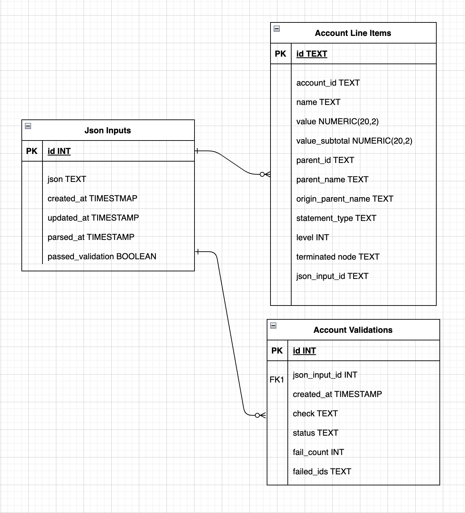

# README

## Approach

Having worked with financial data before, this structure was certainly unique. First, I visually reviewed the JSON to understand the structure. I ran a simple pretty-print on the provided blob (see `data_pretty.json`) to confirm it's valid and make it more readable.

The `ASSETS` section has a clear hierarchy:  
Type (`Asset`) → Grouping (`Current`/`Fixed`) → Subgrouping (`Bank`/`AR`/`Other`).  

The `LIABILITIES` section introduced the first wrinkle — it contains two different `Accounts Payable` entries with the same name. However, all the inner structures follow a similar pattern. Given this, I designed a table with a recursive structure that can support **N** levels of nesting.

### ERD Fields

- `id` / `account_id` – Each data block may have a `null` `account_id`, including both parent and child nodes. We must derive a unique ID to key off of. A standard MD5 hash of the node's path (e.g., `"Equity>Net Income"`) provides a reproducible surrogate ID.
- `name` / `value` – Directly from the data.
- `value_item_total` – The sum of the `items[]` list within the block. Not strictly necessary, but useful for debugging and for avoiding expensive recursive queries later.
- `parent_id` / `parent_name` – Used to support recursive joins.
- `origin_parent_name` – The top-level name from the original hierarchy (`Assets`, `Liabilities`, or `Equity`). Useful for downstream classification and reporting.
- `statement_type` – One of `assets`, `liabilities`, or `equity`.
- `level` – The depth of nesting for each node. Helpful for debugging.
- `terminated_node` – A boolean indicating whether this block has only a `value` and no `items[]`.

## Validation Checks

Once parsed into a clean DataFrame/table, I performed several validation checks. Here's what I looked for (without domain-specific context):

1. **Roll-Up Validations**  
   The `value` for each block should equal the sum of its `items[]`.

2. **Derived ID Uniqueness**  
   Derived IDs must be unique to prevent duplicate records. Two `items[]` with the same name and missing or identical `account_id`s are a serious red flag.

3. **Accounts have Names**
   All Accounts need a name to key off of if ID's are not guarenteed 

3. **Numeric Values**  
   All `value` fields should be numeric. While credit cards can have positive or negative balances, certain accounts (e.g., `Assets`) should only be positive. This needs further rules-based enforcement.

4. **Unexpected Statement Types**  
   The data is expected to include only `assets`, `liabilities`, and `equity`. If a fourth statement type appears, we should be alerted.

5. **Equity Calculation**  
   The classic formula `Equity = Assets - Liabilities` should hold true. If not, that suggests incomplete or incorrect data.

## Inconsistencies Found

- **Liabilities Mismatch**  
  The `Current Liabilities` block reports a total value of `$1,014,525.75`, but its sub-items (`Accounts Payable` and `Credit Cards`) only sum to `$937,527.65`. This is a major red flag indicating potential missing data.

- **Repeated Names**  
  Some nodes reuse the same account name at multiple levels (e.g., `Current Liabilities > Accounts Payable > Accounts Payable`). While not inherently bad (names might be editable in source systems), it requires extra care when parsing or matching.

- **Missing `account_id`**  
  The `Net Income` node under `Equity` lacks an `account_id`, the only terminal node with a missing ID. This raises concerns — where is this data tracked?

- **Unbalanced Financials**  
  My reconciliation showed a discrepancy of `$105,147.67` — either assets are understated or liabilities are overstated.

## If I Had More Time

- Build more business logic validation as it makes sense (e.g., Only positive for `Assets`, etc.)
- Write recursive SQL query (and macro) to verify roll-ups.
- Below is a V2 of the ERD that is closer to what you'd see in a production enviornment 

The `Json Inputs` and `Account Validations` tables are critical for supporting production-grade robustness and traceability. The `Json Inputs` table serves as the landing table for all ingested payloads, capturing metadata such as timestamps for creation, parsing, and whether the payload passed validation. This ensures auditability, history (very important for finance data) and simplifies debugging. The `Account Validations` table logs each validation run against a payload, recording the specific checks performed, their outcome, and any failed nodes for reporting purposes.